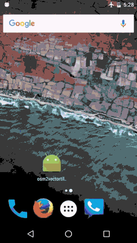

# osm2vectortiles-android
Working example of osm2vectortiles for android

Building upon https://github.com/klokantech/osm2vectortiles-ios, now an Android app can be built with local osm2vectortiles, styles, glyphs and sprites.

Features

* 100% local data (notice in the animation that the Android is in airplane mode)
* Vector data built using http://OSM2VectorTiles.org
* Styling of the countries is from https://github.com/klokantech/mapbox-gl-js-offline-example

* caveat — this animation is speed up 2x for demo purposes
(built with `gifify android.mov -o android.gif --speed 2`)
